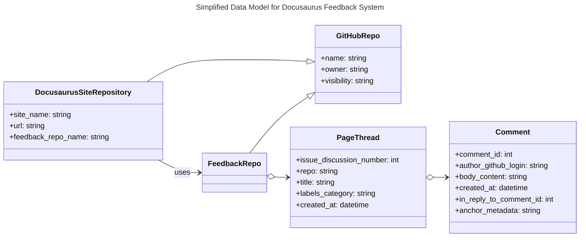
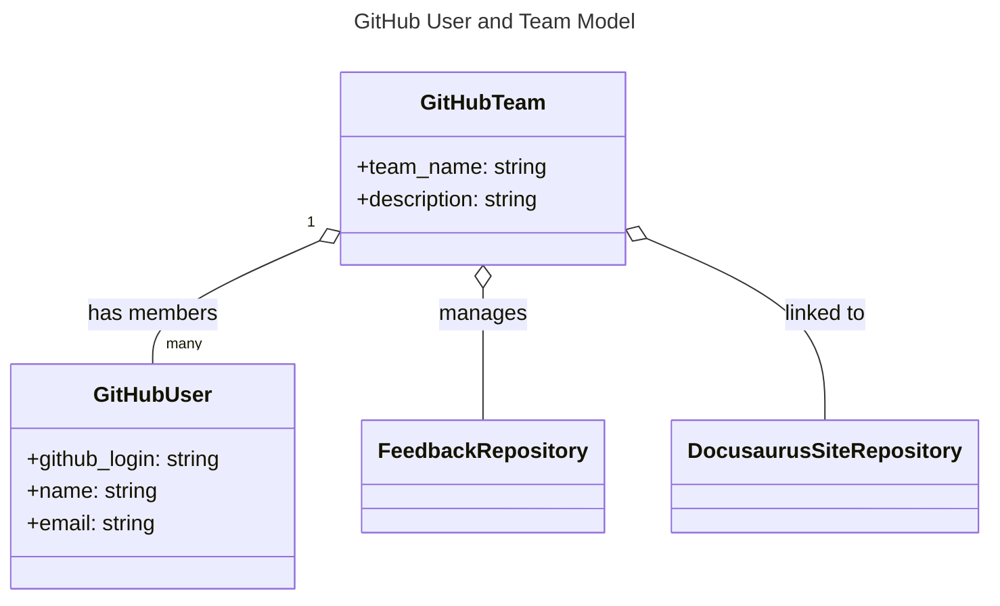

# Data Model

With GitHub Issues/Discussions as the source of truth, the "data model" shifts to mapping UI anchors to GitHub objects rather than storing comments locally.

- Page thread
  - Represented by a single GitHub Issue or Discussion per documentation page (or per anchored section if finer granularity is desired).
  - Key fields: repo, issue/discussion number, title, labels/category, created_at.
- Comment
  - Represented by a GitHub Issue comment or Discussion reply.
  - Key fields: comment id, author (GitHub login), body (content), created_at, in_reply_to (for threaded replies), metadata (JSON block in the body or structured markdown) for anchors such as section identifiers.
- Anchor/Section identifier
  - A short stable identifier (e.g., HTML id, heading slug, or hash of surrounding content) included in the comment body or as structured metadata so the client-side widget can render the comment inline at the correct spot.
- Visibility / Authorization
  - Determined by GitHub: repo visibility, repository membership, team membership, and GitHub App permissions. Using private repos or org-only discussions enforces classroom visibility without extra infrastructure.

Page Thread and Comment entities are linked to a GitHub Repository representing the Docusaurus site and its feedback storage. This is not directly the Docusaurus site itself but the GitHub repo where the Issues/Discussions are stored. This is so comment visibility is governed by GitHub's access controls.

The following diagram represents the GitHub User and Team model relevant to the feedback system. Each GitHub Team manages a Feedback Repository where feedback comments are stored as Issues or Discussions. Team membership determines who can view and provide feedback.

Optionally, the Docusaurus site can keep a tiny local cache (JSON file or client-side cache) that maps pages to issue/discussion numbers for faster lookups; this cache is purely an optimization and not the canonical store.
