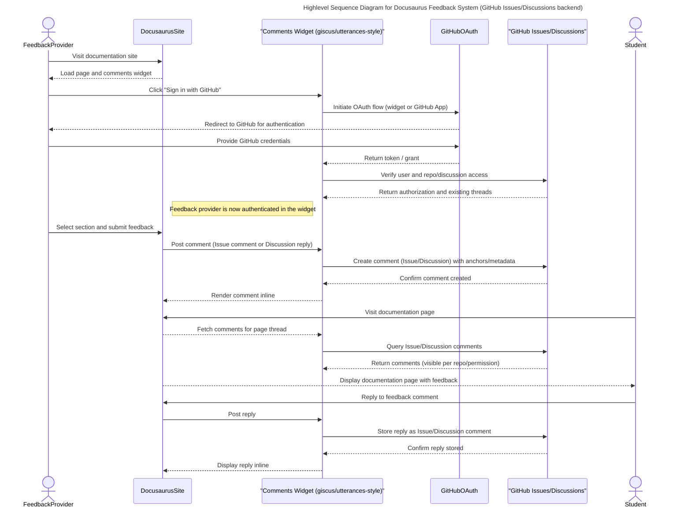
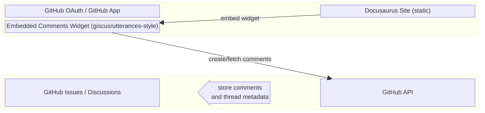

# System Design

## Feedback Use Case Description

1. A feedback provider (teacher or TA) visits the Docusaurus documentation site.
2. The feedback provider clicks on a comments widget ("Sign in with GitHub" or similar) which leverages GitHub authentication and permissions.
3. The widget (client-side comments widget similar to giscus or utterances) creates or fetches a Discussion/Issue on GitHub that represents the page or an anchored comment thread.
4. The feedback provider navigates to a specific documentation page and selects a section to provide feedback on.
5. The feedback provider submits their feedback comment; the widget posts it as a GitHub Issue comment or Discussion reply.
6. The comment is rendered inline on the documentation page by the widget, and visibility is governed by the GitHub repository/discussion visibility (private repo/discussion) and team membership.
7. Students who are members of the GitHub repository's team can also view and reply to the feedback comments via the same widget (or directly in GitHub if preferred).

## System Block Diagram

The goal is to avoid building and maintaining a separate server-backed application. Instead, we embed a client-side comments widget into the Docusaurus site. That widget interacts directly with GitHub Issues or Discussions (the "backend" in this design) for storage, authentication, and permissions.

Key points:

- Comments and replies are stored in GitHub Issues or Discussions. That means visibility and access are governed by the repository's visibility (private repo = repo members only) and GitHub teams.
- The embedded widget (open-source options exist: giscus, utteranc.es, or a custom widget) handles the OAuth handshake (or uses a GitHub App) and posts/fetches comments via the GitHub API.
- No dedicated application server is required for basic operation; the static site + widget + GitHub API handles the workflow.

If a small server-side component is required (for example, to manage a GitHub App private key, perform advanced access-control filtering, or mirror comments into another system), it should be intentionally minimal and serverless (GitHub Actions, Cloudflare Workers, or a tiny AWS Lambda) and only added if the GitHub-only approach cannot meet a concrete requirement. For most classroom uses, using private repositories or private discussion categories will provide the necessary access controls without introducing a full backend.
